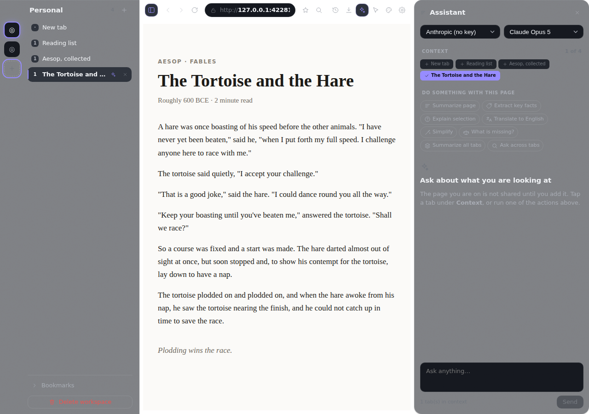

# Radius

**A web browser with an AI assistant built into it — one that can read the page
you're on, and even use the browser for you.**

You bring your own AI account (OpenAI, Anthropic, Google, or any of about thirty
others). Radius doesn't have a server, doesn't have accounts, and doesn't send
your browsing anywhere except to the AI you chose, when you ask it to.



---

## Installing it

**On a Mac**, open the Terminal app and paste in this one line, then press
Enter:

```
curl -fsSL https://raw.githubusercontent.com/starharbor2491/Radius/claude/ai-productivity-browser-plan-fuijdl/scripts/install-mac.sh | bash
```

That's the whole thing. It puts Radius in your Applications folder and opens it.
You don't need to install anything first.

<details>
<summary>What that line actually does, if you'd rather know before running it</summary>

It downloads a short script and runs it. The script either downloads a
ready-made copy of Radius, or — if there isn't one for your Mac — builds one,
which takes a few minutes. Either way it puts the finished app in Applications
and cleans up after itself. You can [read the script
first](scripts/install-mac.sh) if you like.

It will ask for your password **only** if your Applications folder needs
permission to be written to. Nothing is sent anywhere.

Needs macOS 12 (Monterey) or newer.

The address above points at the branch this is being developed on. Once it is
merged, the shorter permanent one works instead:

```
curl -fsSL https://raw.githubusercontent.com/starharbor2491/Radius/main/scripts/install-mac.sh | bash
```
</details>

**A note the first time you open it.** Radius isn't signed with a paid Apple
developer account, so macOS may be cautious about it. The installer handles this
for you. If macOS still complains, right-click Radius in your Applications
folder and choose **Open** — you only have to do that once.

**To remove it:** drag Radius from Applications to the Trash. To also delete
your tabs, bookmarks and settings, delete the folder
`~/Library/Application Support/Radius`.

**Windows and Linux** aren't packaged yet. The app runs on both — see
[Building it yourself](#building-it-yourself) at the bottom.

---

## Connecting an AI

Radius doesn't come with an AI included, and there's no subscription to Radius
itself. Instead you connect an account you already have (or make one), and you
pay that company directly for what you use. That's what an **API key** is: a
long password from an AI company that lets an app like Radius talk to it on
your behalf.

To set one up:

1. Click the **gear icon** ⚙ in the toolbar to open Settings.
2. Scroll to **AI providers**. Every provider Radius knows about is listed —
   OpenAI, Anthropic, Google Gemini, xAI's Grok, DeepSeek, OpenRouter,
   Fireworks, DeepInfra, Cerebras, Groq, Mistral, and more.
3. Find yours, click it, and there's a **Get a key** button that opens the right
   page on their website.
4. Paste the key in and press Save.

That's it — Radius then asks the provider which AI models your key can use, so
you don't have to know any model names.

**Your key is stored in your Mac's own password store**, the same one that keeps
your Wi-Fi passwords. It never leaves your machine except to talk to the
provider you gave it to.

<details>
<summary>Running an AI on your own computer instead</summary>

If you use Ollama, LM Studio, or something similar, they're in the same list —
they need no key at all, just the address they run on (Radius fills in the usual
one for you). Nothing leaves your computer in that setup.
</details>

---

## What you can do with it

### Ask about the page you're reading

Click the **✨ sparkle icon** to open the assistant. Under **Context**, tap any
tab to share it, then ask away. Or skip the typing entirely and use one of the
one-tap buttons:

| Button | What you get |
|---|---|
| Summarize page | The key points, in a few bullets |
| Extract key facts | The names, numbers and dates worth keeping |
| Explain selection | Highlight something confusing, get it in plain words |
| Translate to English | The page, or just what you've highlighted |
| Simplify | The same thing said more clearly |
| What is missing? | The caveats and counterpoints the page leaves out |
| Summarize all tabs | What you're working on, across everything you have open |
| Ask across tabs | One answer drawn from all your open pages at once |

Nothing is shared with the AI until you add it. The assistant can't see a page
you haven't handed it.

### Let it use the browser for you

Click the **cursor icon**, describe a task — *"find the pricing and tell me the
cheapest plan"* — and press Start. It reads what's on screen, then clicks and
types like a person would.

**You can watch it the whole time.** Its cursor is drawn right on the page, with
a label, and it glides between things rather than jumping, so you can follow
what it's doing. It stops on its own after fifteen steps, the Stop button
interrupts it mid-move, and it's instructed to refuse passwords, card details
and checkouts.

### Keep your work in separate spaces

The small buttons down the far left edge are **workspaces** — separate sets of
tabs that don't mix. Work in one, personal in another, a project in a third.
Each remembers its own tabs, its own layout, and its own colours. Switching is
one click.

Within a workspace you can group tabs together and collapse a group you're not
using. Tabs you haven't touched for a while go to sleep on their own and wake up
when you click them, keeping their place on the page — that's what makes a large
pile of open tabs bearable. Settings lets you change how long a tab sits idle
first — anywhere from a minute to eight hours.

### Make it look how you want

Click the **palette icon** for the Theme Studio. Eleven ready-made looks, from
near-black to warm paper, and a preview of each that's an actual working
miniature of the browser rather than a colour swatch.

If you want to go further, everything is adjustable: colours, how frosted the
glass looks, corner roundness, spacing, text size, and how bouncy the animations
are. If you don't like animation, you can turn it off and it genuinely stops.

You can save a look as a file and send it to someone, and they can load it. Theme
files are just settings — they can't contain a program, so there's nothing
harmful one could do.

### Move the panels around

Any panel — the assistant, history, downloads, settings — can be dragged to the
left side, the right side, or the bottom. Grab its title and drop it where you
want. Each workspace remembers its own arrangement.

---

## Keyboard shortcuts

These are the defaults on a Mac. On Windows and Linux, use **Ctrl** wherever you
see ⌘.

| Shortcut | What it does |
|---|---|
| ⌘T · ⌘W · ⌘⇧T | New tab · close tab · reopen the one you just closed |
| ⌘L | Jump to the address bar |
| ⌘K | Search everything you can do, by name |
| ⌘J | Open the assistant |
| ⌘⇧A | Let the assistant use the page |
| ⌘B | Show or hide the sidebar |
| ⌘⇧N | New workspace |
| ⌘F | Find on this page |
| ⌘Y · ⌘⇧J | History · downloads |
| ⌘+ · ⌘- · ⌘0 | Zoom in · out · back to normal |

**Every one of these can be changed.** In Settings, click the shortcut you want
to replace and press the keys you'd rather use. There are also ready-made sets
if you're used to another browser — a Vim-style one, an Arc-style one, and a
Chrome-style one.

**⌘K is worth learning first.** It's a search box for the browser itself: press
it, type a few letters of what you want ("bookmark", "theme", "workspace"), and
press Enter.

---

## Where your things are kept

Everything Radius knows — your tabs, bookmarks, history, settings — lives in one
file on your own computer, in
`~/Library/Application Support/Radius`. There is no Radius account, no server,
and nothing to sign up for.

The only thing that ever leaves your machine is what you explicitly hand to the
AI: the pages you add to Context, or what you type into the assistant. That goes
to the provider you chose and nowhere else.

If you set a spending limit in Settings, Radius keeps a running total of what
you've used and can warn you or stop before you go over. Where a provider
doesn't publish its prices, Radius says so rather than guessing at a number.

---

## Building it yourself

<details>
<summary>For developers</summary>

Radius is Electron + React + TypeScript. There are no native modules, so there's
no compile step and nothing to rebuild when Electron updates:

```bash
npm install
npm run dev
```

| Command | What it does |
|---|---|
| `npm run dev` | Run in development, with hot reload for the chrome |
| `npm run build` | Typecheck, then build main, preload and renderer |
| `npm test` | Unit tests (vitest) |
| `npm run typecheck` | Typecheck all three TS projects |
| `npm run smoke` | Boot the chrome with a stubbed bridge and assert it renders |
| `npm run smoke:app` | Boot the real app, navigate, drive the agent through real IPC |
| `npm run test:install` | Exercise the macOS installer against stubbed tools |
| `npm run package:mac` | Build a macOS `.app`, `.dmg` and `.zip` |

In a headless environment, prefix Electron commands with `xvfb-run -a` and pass
`--no-sandbox`.

Further reading:

- **[ARCHITECTURE.md](ARCHITECTURE.md)** — why the odd-looking decisions are the
  way they are. The z-order trick, why `backdrop-filter` can't see page pixels,
  the three provider tiers, the layout system, the agent.
- **[DESIGN.md](DESIGN.md)** — the rules the interface follows.
- **[ROADMAP.md](ROADMAP.md)** — what's done and what's next.
- **[CLAUDE.md](CLAUDE.md)** — conventions, and the traps that have bitten
  already.

</details>

---

## Licence

AGPL-3.0-or-later — free to use, and free to modify, as long as changes you
distribute stay under the same licence. See [LICENSE](LICENSE).
